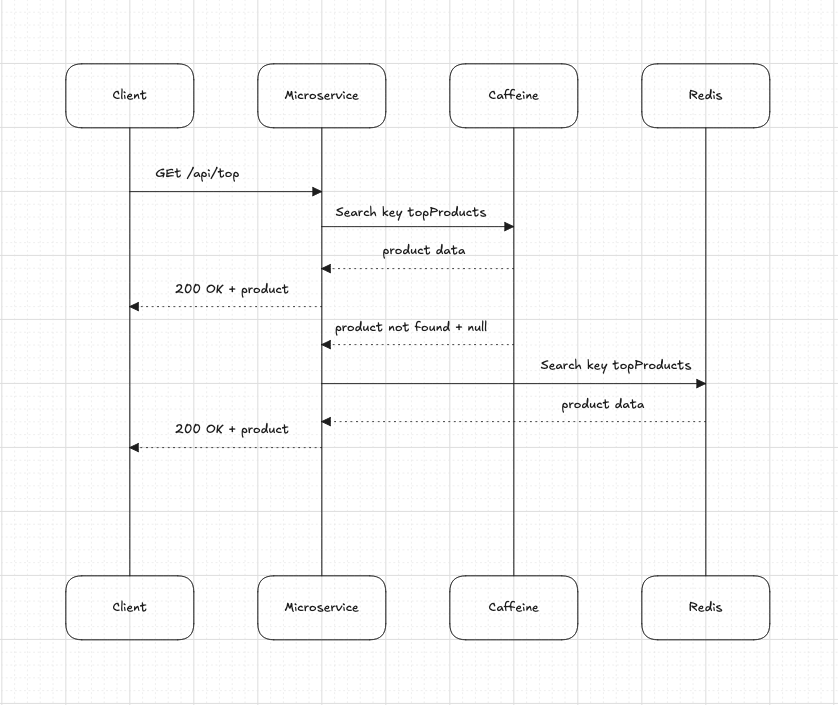

# hybrid-cache-L1-L2-redis


Este ejemplo muestro como implementar cache de Redis en dos niveles **L1 + L2** junto a la libreria Caffeine.

En Redis hay un temrino llamado **hot keys**.

Las **host key** o llaves caliente son llaves que reciben una 
cantidad de llamadas desproporcionada en un nodo especifico de 
un cluster de Redis.

```
NODO A → 90%    trafico
NODO B → 5%     trafico
NODO C → 5%     trafico
```
El cluster esta mal distribuido.

Existe varias soluciones, mostrare dos (2):

1. Duplicar la llave en todos los nodos del cluster de Redis existente. Se podria logar por medio de un cron o algun proceso batch.
```
List<Product> topProduct = rabkingProduct.getTopProduct();
redis.set("top_product:1", topProduct);
redis.set("top_product:2", topProduct);
redis.set("top_product:3", topProduct);
 ```

2. Tener dos niveles de Cache **L1 + L2** 
Bajo el mismo escenario, podemos tener 10 instancia del un mismo microservicio, iniclamnete 
cada instancia consulta Redis, pero al momento de recuperar la informacion, persiste la data en 
**Caffeine** . La segunda consulta, ya Redis no se conulta y esto evitara una alta demanda de lectura sobre un nodo especifico de Redis.



Si tenemos 10 instancia, cada instancia inicialmente consulta Redis, pero al momento de recueprar la informacion, persiste la data en local “caffeine”. 
En la segunda consulta, ya Redis no se consulta y esto evitaria una alta demanda de lectura sobre un nodo especifico de Redis.


## Ejecutar Proyecto

```
> bash run.sh
```